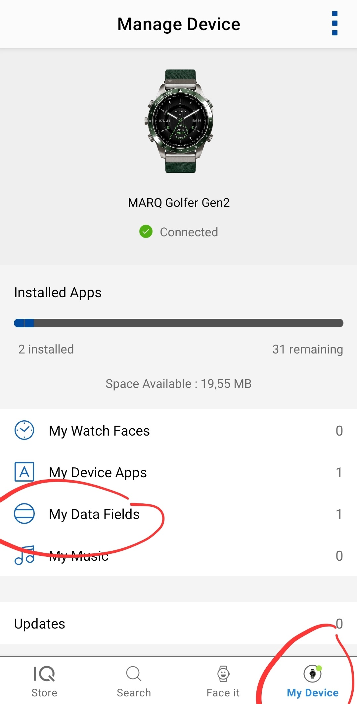
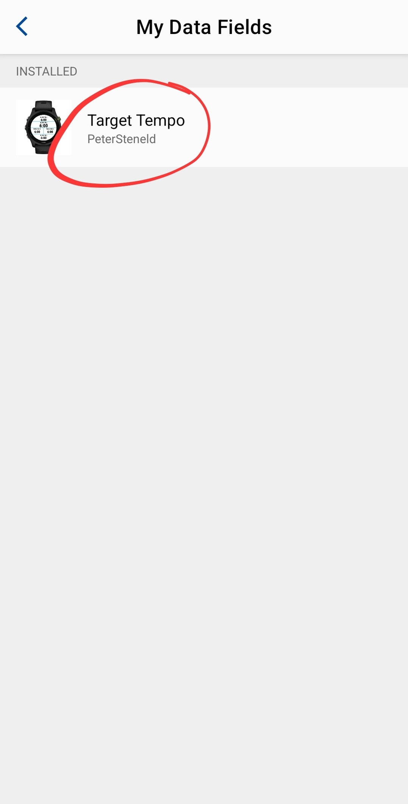
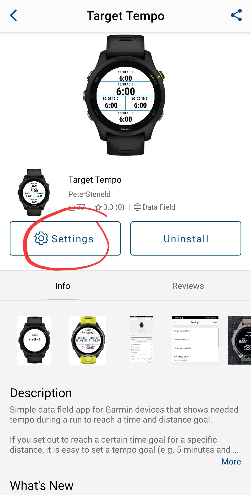
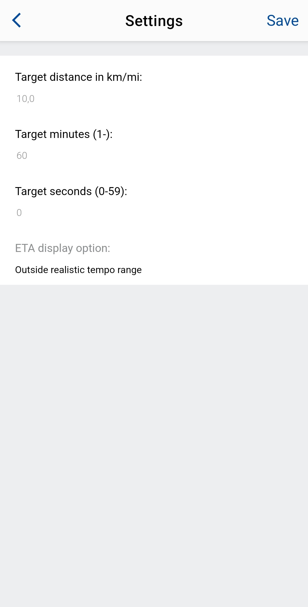

# Target Tempo
## Purpose
Simple datafield app for Garmin devices that shows needed tempo during a run to reach a time and distance goal.
## Description
If you set out to reach a certain time goal for a specific distance, it is easy to set a tempo goal (e.g. 5 minutes and 30 seconds per km to reach the goal of 55 minutes over 10 km). However, often your tempo changes during the run due to variations over the track (hills, surface conditions, your level of fitness etc.) so after a couple of kilometers you need, or can, run in a different tempo to reach your goal.

This data field constantly gives you updates on which tempo you need to withhold given the remaining time and remaining distance. The tempo will be displayed as either minutes per km or minutes per miles (statute) depending on your units setting in the device.

You also have the possibility to get some related information during the run, i.e. the Estimated Time of Arrival (ETA), which in this case is total time needed to arrive at your target distance from the start of the activity. The ETA is calculated based on the remaining distance and your current speed as reported by the watch to the data field.

Since this is a data field you must set your time and distance targets in the Connect IQ app. Once that is done and you start your activity, the data field will reflect your target settings in its label, e.g. “120:00 21,1” for a half marathon in two hours (the distance is only showing one decimal rounded, but internally it uses what you set).

There is also a display option for when ETA is shown instead of target tempo. You can choose between:
- Outside realistic tempo range
- During last km/mi
- Alternate between tempo and ETA
- Always show ETA

“Outside realistic tempo range” (2-20 if unit is km and 3-30 if unit is miles) is default since you often end up there during the last couple of hundred meters of the run unless you really managed to stick to your goal.

Finally, when you reach the distance goal the data field stops updating and instead shows the finishing time over the target distance, e.g. “fin 98:30”. Since the data field is updated once a second it can thus differ a second from activity reports provided by Garmin standard functionality.
## Configure the app
The Target Tempo app is configured using the Connect IQ app.

While in Connect IQ click on "My Device", "My Data Fields" and then on the Target Tempo app

 

Click on Settings after which you set your targets for distance (kilometers or miles) and time. You can also click on "ETA display option" to get a drop down meny of the available alternatives described above

 

When hitting Save the Connect IQ app automatically syncs the new settings with your device (if of course turned on and within reach). The label of the app in the data field will reflect your time and distance settings so you can confirm that the device was uppdated accordingly.

## Implementation notes
The math for calculating target tempo and ETA is simple and uses only three data points from the watch: elapsed time, elapsed distance, and current speed in relation to your target settings. The trick is to avoid too much fluctuation in the calculated values. Hence moving averages (MA) are used to smoothen a bit. The target tempo uses an exponential MA window size of 10, i.e. the 10 last readings (1 every second) are used where the last one is weighted the most. The ETA is slightly more complicated since even smaller changes in speed early in the run greatly affects the estimated value. Hence, ETA uses a dynamic simple MA where the window size is 120 when remaining distance is 4 km or more, it steps down (1 step per second) to 60 when between 4 and 1.5 km left and finally it steps down to 10 when between 1.5 and 0 km left.

## Testing notes
The data field has been tested in real life on a Marq gen 2, all the other watches supported has been tested in the simulator provided by Garmin in the SDK. Some of the watches with a small clock face may in some layouts cut a very small part of the label. For the Instinct series you probably need to choose wisely in which field to put it, the smaller round field did cut off also data when tested in the simulator. 

The data field app has been left to run a half marathon in the simulator to make sure that there are no memory leaks.
## Release notes
### v0.4.0
- Adds support for statute miles. When the device is set to use miles as units, the input distance is interpreted as miles and the target tempo will be displayed as minutes per mile.
- Adds support for Epix, Fenix, Instinct and Venue devices
